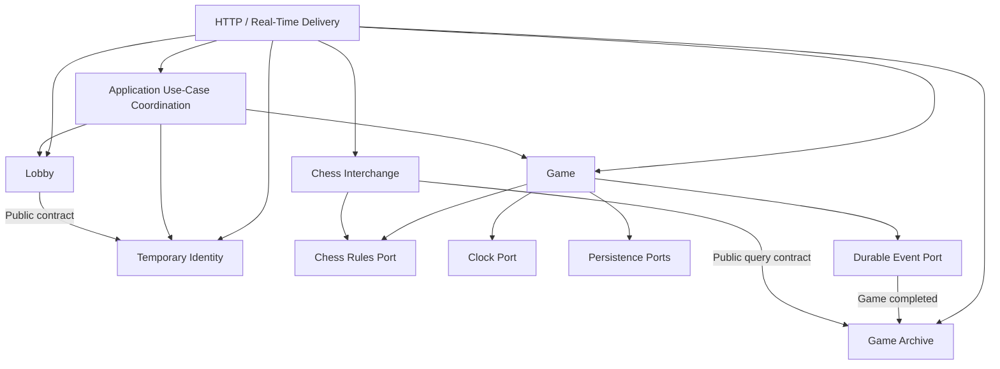

# Modular Boundaries

## Document Control

| Field          | Value                    |
| -------------- | ------------------------ |
| Status         | Accepted                 |
| Version        | 1.0                      |
| Decision owner | Yasmany                  |
| Source         | Session 006 and ADR-0001 |

## Purpose

Define the internal boundaries of the modular monolith before technology selection or implementation begins.

## Module Set

### Temporary Identity

Owns globally unique temporary-name claims, private sessions, expiration, renewal, release, and identity recovery.

### Lobby

Owns waiting-game creation and cancellation, the public available-game list, the one-waiting-or-active-game admission rule, and atomic opponent assignment.

### Game

Owns authoritative active games, participants and colors, position, turn, chess-rule decisions, confirmed moves, clocks, draw state, resignation, disconnection state, recovery state, termination, and result.

`Game` is the only module authorized to change an active position or official result.

### Game Archive

Owns public completed-game query capabilities, filters, details, and replay-oriented read representations. Its records derive from authoritative completed games produced by `Game`.

### Chess Interchange

Owns PGN import validation and export representation, including SAN, FEN, and declared initial positions. It does not control active games.

## Technical Boundaries

The following are adapters or cross-cutting capabilities rather than business modules:

- HTTP and real-time delivery.
- Persistence adapters.
- Chess-rules adapter.
- Clock adapter.
- Observability.
- Configuration.
- Security plumbing.

The separately delivered Web Client has its own internal boundaries and consumes product contracts. It is never authoritative.

## Data Ownership

A single physical transactional database may be used, but each module owns its tables or logical schema.

| Module             | Owned data                                                                                               |
| ------------------ | -------------------------------------------------------------------------------------------------------- |
| Temporary Identity | Name claims, private temporary sessions, expiration and release state                                    |
| Lobby              | Waiting games and player-participation admission reservations                                            |
| Game               | Started games, participants, moves, positions, clocks, draw and connection state, termination and result |
| Game Archive       | Public query and search projections derived from completed authoritative games                           |
| Chess Interchange  | No automatically persisted visitor-imported PGN                                                          |

A module must not directly read or modify another module's tables. Cross-module behavior uses documented public contracts.

## Business Invariant Ownership

Lobby owns the admission invariant that one temporary player may have at most one waiting or active game. Game retains the authoritative participant identifiers after a game starts.

Game owns every invariant that changes an active game's position, turn, clock, move history, or result.

## Transaction Boundaries

Use cases requiring immediate cross-module consistency may coordinate public module operations within one local database transaction. The principal MVP example is accepting an opponent, removing the waiting-game opportunity, creating the authoritative game, and transitioning the participation reservation.

Cross-module transactions must remain explicit and limited to invariants requiring immediate consistency. They must not become unrestricted shared-data access.

## Durable Completion Publication

When a game terminates, Game persists the authoritative terminal state and a durable completion event atomically. Game Archive consumes the event to create public query projections.

Archive publication may be briefly delayed but must not lose a completed game. A transactional-outbox mechanism or an equivalent proven mechanism will be used when required by the selected stack.

## Shared-State Rule

Modules do not share mutable domain entities. They exchange identifiers, commands, results, immutable events, and purpose-specific data contracts.

Chess Interchange obtains export or validation inputs through public query contracts and never reads another module's storage directly.

## Dependency Rules

### Allowed Directions

- Delivery adapters depend on module application APIs.
- Lobby may use the Temporary Identity public contract for required session or identity validation.
- Game depends on abstract chess-rules, clock, persistence, and event-publication ports.
- Game Archive consumes durable Game completion events.
- Chess Interchange depends on a chess-rules port and may use the Game Archive public query contract for public-game export.
- An application use-case coordinator may call multiple public module APIs for an explicitly documented local transaction.

### Forbidden Dependencies

- Domain modules must not depend on HTTP, WebSocket, UI, framework, database, or provider-specific types.
- Game must not depend on Lobby or Game Archive.
- Game Archive must not issue active-game commands.
- Cyclic module dependencies are forbidden.
- A module must not import another module's internal types or implementation.
- Adapters must not contain business decisions.

## Ports and Adapters

Business logic defines the contracts it offers and requires. Technical implementations adapt HTTP, real-time protocols, persistence, time, chess libraries, and event delivery to those contracts.

Ports are introduced at meaningful boundaries rather than mechanically for every function. Principal examples include:

- Input ports for claiming an identity, joining, moving, resigning, and offering a draw.
- Output ports for clocks, chess rules, repositories, and event publication.

## Commands and Events

Synchronous commands handle actions requiring an immediate authoritative response, including identity claims, lobby actions, moves, resignation, and draw actions.

Durable events represent committed consequences processed later, including game completion and archive projection.

State-changing commands carry identifiers that support retry detection. Event consumers must be idempotent. Event schemas are documented and versioned.

Client responses use authoritative command results. They do not wait for or infer success from asynchronous archive projections.

## Boundary Enforcement

- Automated architecture tests detect forbidden module dependencies.
- Contract tests verify ports, adapters, and event compatibility.
- Module diagrams and implementation boundaries must remain synchronized.

## Cross-Cutting Rules

### Temporary Authentication and Authorization

Delivery extracts a presented credential. Temporary Identity validates the session. Each application use case authorizes whether the validated identity may perform the requested action.

### Stable Errors and Localization

Modules return typed errors with stable codes. The Web Client localizes user-facing messages. Persisted results, termination reasons, and other cross-language values use stable codes rather than localized phrases.

### Observability

Correlation identifiers propagate through commands and events. Logs, metrics, and traces observe behavior without changing business decisions or exposing credentials.

### Configuration

Configuration is validated at startup and injected explicitly. Hidden global configuration and service locators are forbidden.

### Time

All time-dependent business logic uses a clock port. Domain code must not read system time directly.

### Identifiers

Public and cross-module identifiers use an appropriate generation abstraction and do not expose database implementation details unnecessarily.

### Transaction Management

Application coordination defines transaction boundaries. Domain entities do not open database connections or commit transactions.

### Input Security

Technical input validation, parameterization, escaping, payload limits, and rate controls belong in appropriate adapters. Business authorization remains in application use cases.

## Extraction Rule

A module becomes a separately deployed service only when evidence demonstrates a need for independent scale, failure isolation, security boundary, release cadence, ownership, or operations. Extraction requires a new ADR.

The real-time delivery gateway is the first candidate if experiments or production metrics show that shared deployment is a material limitation. It is not preemptively separated.

## Dependency Diagram

Arrows indicate allowed dependency or message direction. They do not authorize access to another module's private storage or types.

## Approval

| Role            | Name    | Decision                | Date       |
| --------------- | ------- | ----------------------- | ---------- |
| Project owner   | Yasmany | Accepted                | 2026-08-17 |
| AI collaborator | Codex   | Interviewed and drafted | 2026-08-17 |

## Revision History

| Version | Date       | Change                                                                                                 | Decision owner |
| ------- | ---------- | ------------------------------------------------------------------------------------------------------ | -------------- |
| 0.1     | 2026-08-17 | Module-boundary elicitation opened.                                                                    | Yasmany        |
| 1.0     | 2026-08-17 | Modules, ownership, transactions, dependencies, cross-cutting rules, and extraction criteria accepted. | Yasmany        |
