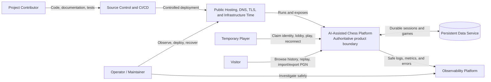

# System Context

## Document Control

| Field          | Value       |
| -------------- | ----------- |
| Status         | Accepted    |
| Version        | 1.0         |
| Decision owner | Yasmany     |
| Source         | Session 004 |

This document will define the people, external systems, trust boundaries, and principal information flows surrounding the MVP.

## Human Actors

### Visitor

A Visitor does not need a temporary player identity. A Visitor may:

- Select an interface language.
- Browse and search public completed-game history.
- View and replay completed games.
- Export public games as PGN.
- Import a PGN for private, non-persisted replay.

### Temporary Player

A Temporary Player claims a globally unique temporary display name and private session. A Temporary Player may:

- Enter the public game lobby.
- Create or cancel a waiting game.
- Join an available game.
- Play and reconnect to an active game.
- Resign and participate in draw offers.
- Use Visitor capabilities.

### Operator/Maintainer

An Operator/Maintainer observes system health, errors, capacity, deployments, and recovery. The MVP will not build a dedicated administrative product interface. Protected hosting, deployment, database, and observability tooling will support operational work.

### Project Contributor

Yasmany, AI models, coordinating agents, and specialized agents contribute to requirements, decisions, code, tests, documentation, and verification. They are development-process participants rather than runtime product actors.

### Future Actors

Registered users, coaches, students, administrators, and tournament organizers belong to the long-term vision. They are not implemented MVP roles and must not silently introduce current product capabilities.

## External Systems and Environments

### Web Browsers

Supported browsers render the interface, collect user intent, maintain HTTP and real-time connections, and present server-confirmed state. Browsers are outside the trusted authority boundary.

### Public Hosting and Networking

Hosting and networking provide public execution, DNS, encrypted transport, and trusted infrastructure time. Specific providers remain undecided.

### Persistent Data Service

Persistent storage retains required temporary sessions, active games, confirmed movements, and completed-game history. Data behavior belongs to the product, although operation may be delegated to a managed service.

### Observability Platform

An observability platform receives safe structured logs, metrics, and error information. It may be managed or self-hosted. Its failure must not corrupt authoritative game processing.

### Source Control and CI/CD

External development infrastructure hosts the public repository, executes required checks, and supports controlled deployments. Its unavailability may delay delivery but must not corrupt runtime games.

### Trusted Infrastructure Time

Runtime infrastructure must provide sufficiently consistent time for authoritative clocks, expirations, timestamps, and operational correlation.

## Explicitly Unrequired MVP Integrations

The MVP does not require:

- External identity providers.
- Email or SMS.
- Payments.
- Advertising or commercial analytics.
- Social-network integration.
- A remote analysis engine such as Stockfish.
- External matchmaking.
- Persistent storage of visitor-imported PGN files.
- Runtime AI services.

## Managed-Service Conditions

Managed services may be evaluated when they reduce operational complexity. Provider selection remains a separate decision. Material or recurring cost requires explicit human approval. Important data and contracts require a reasonable export or replacement strategy.

## Product Responsibilities

The product owns:

- Claiming, protecting, renewing, and releasing temporary identities.
- Maintaining the public lobby and atomically assigning opponents.
- Validating chess rules and maintaining authoritative game state.
- Maintaining official clocks and results.
- Serializing concurrent game actions.
- Making confirmed actions durable before reporting success.
- Recovering temporary sessions and active games.
- Publishing completed-game history and replay.
- Validating, importing, and exporting PGN.
- Providing localization and accessibility behavior.
- Emitting safe operational telemetry.
- Applying input and abuse controls.

## Browser Responsibilities

The browser owns presentation, interaction, language preference, non-authoritative animation, smooth clock estimates, and storage of the selected private-session mechanism.

The browser is not authoritative for identity, turn order, legal rules, clock values, position, result, or persistence. Visual prediction must reconcile with server confirmation.

## Infrastructure Responsibility Boundary

External infrastructure operates contracted capabilities. The product remains responsible for defining required backup, recovery, security, observability, portability, and failure behavior rather than assuming a provider makes those concerns correct automatically.

## Principal Trust Boundary

All browser and public-network input crosses an untrusted boundary before affecting authoritative state. Only validated and authorized commands may cross into the trusted game-state boundary.

## Context Diagram

## Approval

| Role            | Name    | Decision                | Date       |
| --------------- | ------- | ----------------------- | ---------- |
| Project owner   | Yasmany | Accepted                | 2026-08-17 |
| AI collaborator | Codex   | Interviewed and drafted | 2026-08-17 |

## Revision History

| Version | Date       | Change                                                                                    | Decision owner |
| ------- | ---------- | ----------------------------------------------------------------------------------------- | -------------- |
| 0.1     | 2026-08-17 | System-context elicitation opened.                                                        | Yasmany        |
| 1.0     | 2026-08-17 | Actors, external systems, responsibilities, trust boundary, and context diagram accepted. | Yasmany        |
